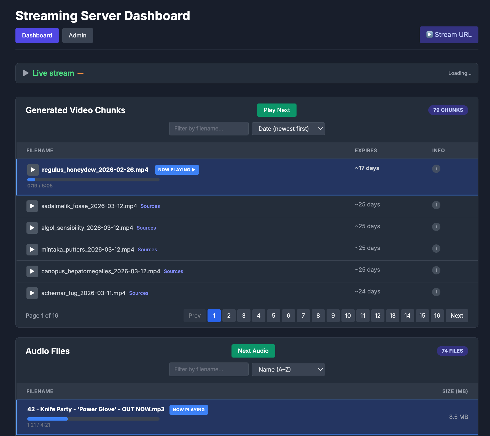
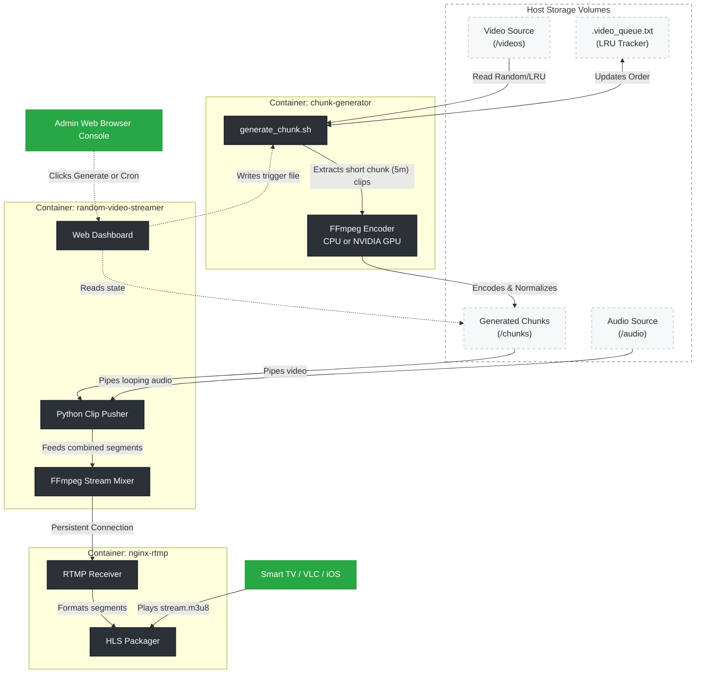

# Random Video Clips Streaming Server

[](https://github.com/vineethvijay/Random-Video-Clips-Streaming-Server/actions/workflows/ci.yml)

A containerized live streaming server that continuously shuffles and streams random short clips from your video collection and plays them as a never-ending HLS live stream - with optional continuous background audio that plays independently from the video shuffling.

## Features

- **Web Dashboard** — view and control video chunks (pagination, Now Playing, progress), see stream stats (hours played, chunks created), open a live HLS stream, check source videos, and watch live system info (CPU, memory, GPU).
- **Continuous live stream** — no playback gaps; clips are piped into a single persistent RTMP connection.
- **Continuous background audio** — mount an MP3 folder; the same track plays across chunk switches (position tracked and resumed). Dashboard shows audio “Now Playing” and progress within the track.
- **Strict LRU + segment tracking** — video files are rotated with a Least-Recently-Used queue. A JSON-based **segment tracker** records used time ranges per file so new clips prefer **unused** segments; a Python helper (`scripts/segment_tracker.py`) picks start times accordingly.
- **Chunk metadata** — each generated chunk has a `.meta.json` sidecar listing source video filenames (no database).
- **Persistent stats** — optional `STATS_DIR` (e.g. `./stats`) stores hours played and chunks-ever-created so they survive restarts and new deployments.
- **Normalized output** — all clips transcoded to a consistent resolution/fps so transitions are smooth.
- **Compatible** — works with VLC, Safari, Samsung TV IPTV apps, and any HLS player.
- **Production-grade** — Dockerized with Gunicorn, healthchecks, and log rotation.

<details>
<summary><strong style="color:#0366d6">📷 Dashboard Preview</strong></summary>



</details>

## Architecture



### Chunk Generation Randomization

See [Chunk Generation Flow](docs/chunk-generation.md) for the full diagram and behavior summary.

The system operates across three decoupled, robust containers:
- **`chunk-generator`** — runs in the background polling for manual UI triggers or automated schedules to build 5-minute `.mp4` chunks from your video library. Uses a per-video LRU queue and a segment tracker (`.used_segments.json`) so clip start times prefer unused ranges within each file.
- **`random-video-streamer`** — the brain and web interface. Mixes the chunks with continuous looping background audio, preventing gaps in playback and pushing a 24/7 RTMP feed to NGINX.
- **`nginx-rtmp`** — receives the feed, packages it efficiently into HLS segments on a temporary filesystem, and serves it seamlessly to devices over HTTP.

## Quick Start

**1. Configure `.env`:**
```bash
cp .env.example .env
```
Edit `.env`:
```bash
VIDEO_FOLDER=/path/to/your/videos

# Optional: folder of MP3s to play as continuous background audio
# Leave empty for a silent stream
AUDIO_FOLDER=/path/to/your/music

PORT=8081           # Flask API port
```

**2. Start:**
```bash
docker compose up -d
```

**3. Watch & Manage:**
| URL | Purpose |
|-----|---------|
| `http://server-ip:8081/` | **Web Dashboard** (chunks, audio, live HLS player, stream stats, system info with live CPU/mem/GPU, Generate Chunks, Play next) |
| `http://server-ip:8082/hls/stream.m3u8` | **Live HLS stream** (VLC, Safari, TV apps) |
| `http://server-ip:8081/iptv.m3u` | IPTV playlist (points to the HLS stream) |
| `http://server-ip:8081/api/status` | Server status |
| `http://server-ip:8081/api/stream-status` | Clip pusher status (current chunk/audio, hours played, etc.) |
| `http://server-ip:8081/api/system-usage` | Live CPU, memory, GPU usage (for dashboard) |

## TV Setup

1. Install an IPTV app (e.g. SS IPTV, TiviMate, Smart IPTV)
2. Add playlist URL: `http://server-ip:8081/iptv.m3u`

The IPTV playlist points to the live HLS stream automatically.

## Configuration

The system is configured via environment variables in the `.env` file and service definitions in `docker-compose.yml`.

### 1. Streamer & API Configuration (`random-video-streamer`)

These variables control the Flask API and the RTMP clip pusher.

| Variable | Default | Description |
|----------|---------|-------------|
| `PORT` | `8081` | Host port for the Flask API and IPTV playlist |
| `VIDEO_FOLDER` | `/videos` | Source video directory (mount in Compose) |
| `AUDIO_FOLDER` | `/audio` | Background MP3 directory. If empty, uses video audio. |
| `CHUNK_FOLDER` | `/chunks` | Directory where `.mp4` chunks are read from |
| `STATS_DIR` | *(none)* | **Persistent stats dir.** When set (e.g. `./stats`), hours played and chunks-ever-created are stored here so they survive new deployments. Compose mounts `${STATS_DIR:-./stats}` as `/app/stats`. Ensure this dir exists and is writable by both containers (e.g. `mkdir -p ./stats && chmod 777 ./stats` or match the streamer’s UID). |
| `RTMP_URL` | `rtmp://nginx-rtmp:1935/live/stream` | Internal target for the RTMP stream |

### 2. Chunk Generator Configuration (`chunk-generator`)

These variables control how new video chunks are created from your library.

| Variable | Default | Description |
|----------|---------|-------------|
| `CHUNK_DURATION` | `300` | Target length of a single consolidated chunk (seconds) |
| `CLIP_MIN` | `6` | Minimum length of an individual clip within a chunk |
| `CLIP_MAX` | `6` | Maximum length of an individual clip within a chunk |
| `CHUNKS_PER_RUN` | `4` | How many chunks to generate per execution |
| `MAX_CHUNKS` | `56` | Max number of chunks to keep before pruning oldest |
| `CRON_SCHEDULE` | `0 2 * * *` | Cron schedule for automatic generation (2am daily). Set empty to disable. |
| `VIDEO_DIR` | `/videos` | Where the generator searches for `.mp4`, `.mkv`, `.avi` |
| `OUTPUT_DIR` | `/chunks` | Where the generator writes the final chunks |
| `TUBEARCHIVIST_URL` | *(none)* | TubeArchivist instance URL for metadata extraction (e.g. `https://ta.example.com`). Requires `TUBEARCHIVIST_TOKEN`. |
| `TUBEARCHIVIST_TOKEN` | *(none)* | TubeArchivist API token (from Settings → Application). |

## Hardware Requirements

### GPU Acceleration (NVIDIA) vs CPU (Mac / Linux)
The **Chunk Generator** supports both CPU encoding (`libx264`) and NVIDIA hardware acceleration (`h264_nvenc`).

**For CPU Encoding (Default & Mac-compatible):**
- Ensure `.env` has `HW_ACCEL=none`.
- Run completely natively with `docker compose up -d`.

**For NVIDIA GPU Acceleration:**
- **Drivers**: Host must have NVIDIA drivers and `nvidia-container-toolkit` installed.
- **Config**: Set `HW_ACCEL=nvidia` in `.env`.
- **Run**: Use the GPU override file to reserve hardware resources:
  ```bash
  docker compose -f docker-compose.yml -f docker-compose.gpu.yml up -d
  ```

## API Endpoints

| Method | Endpoint | Description |
|--------|----------|-------------|
| GET | `/` | Web Dashboard HTML |
| GET | `/api/status` | Full server status & config overview |
| GET | `/api/stream-status` | RTMP pusher & current chunk/audio, hours played, chunks created |
| GET | `/api/system-usage` | Live CPU %, memory %, GPU % (for dashboard polling) |
| GET | `/chunks/<filename>` | Serve a chunk file (e.g. for “Play” in dashboard) |
| GET | `/audio/<path>` | Serve an audio file for playback in browser |
| GET | `/iptv.m3u` | IPTV playlist (M3U) for external players |
| POST | `/api/generate_chunk` | Triggers the generator to build new chunks |
| POST | `/api/skip_to_next` | Skip current chunk and advance to next (audio position preserved) |
| POST | `/api/skip_to_next_audio` | Skip to the next audio track |
| POST | `/api/play_chunk` | Play a specific chunk next in the live stream (body: `{"chunk_name": "xyz.mp4"}`) |

## Troubleshooting

**Stream not starting / HLS 404**  
The stream takes ~10 seconds to appear after startup. The app waits for `nginx-rtmp` to be healthy before pushing.

**Check logs:**
```bash
docker compose logs -f random-video-streamer   # Clip pusher & API logs
docker compose logs -f chunk-generator         # Encoding progress logs
docker compose logs -f nginx-rtmp              # HLS server logs
```

## Deploy to Proxmox

See `deploy/README.md`. Run `./deploy/deploy-to-proxmox.sh` to sync to the server. Config in `deploy/config`.

## Scripts

- `scripts/segment_tracker.py` — used by the chunk generator to pick unused time ranges and record used segments (JSON file).
- `scripts/tubearchivist_metadata.py` — fetches TubeArchivist video metadata and extracts model info from descriptions (when `TUBEARCHIVIST_URL` + token set).
- `deploy/deploy-to-proxmox.sh` — rsync deploy to Proxmox/Linux (excludes .env, chunks, videos, etc.)
- `scripts/setup.sh` — initial setup and environment check
- `scripts/start.sh` — start the streaming server

## Segment tracking

The chunk generator keeps a JSON file (`.used_segments.json`, under `STATS_DIR` or the chunk folder) that records which time ranges have been used in each source video. The Python helper `scripts/segment_tracker.py` (used by `generate_chunk.sh`) picks a start time in an **unused** range; if none fit or the tracker is unavailable, it falls back to a random start. This reduces repetition of the same segment within a video.

## TubeArchivist metadata

When your source videos come from [TubeArchivist](https://github.com/tubearchivist/tubearchivist), you can enable metadata extraction so the dashboard shows **model info** (e.g. `Model - https://www.instagram.com/...`) from video descriptions.

**Setup:**
1. Add to `.env`:
   ```
   TUBEARCHIVIST_URL=https://your-ta-instance.com
   TUBEARCHIVIST_TOKEN=your_api_token
   ```
2. Get the token from TubeArchivist → Settings → Application → API Token.
3. Ensure the chunk-generator container can reach the TubeArchivist URL (same host, Docker network, or public URL).

The generator extracts video IDs from paths (`channel_id/video_id.mp4`), fetches metadata via the REST API, and parses lines matching `Model - <url>` in the description. Model links appear in the dashboard’s **Model** column.

## License

MIT
