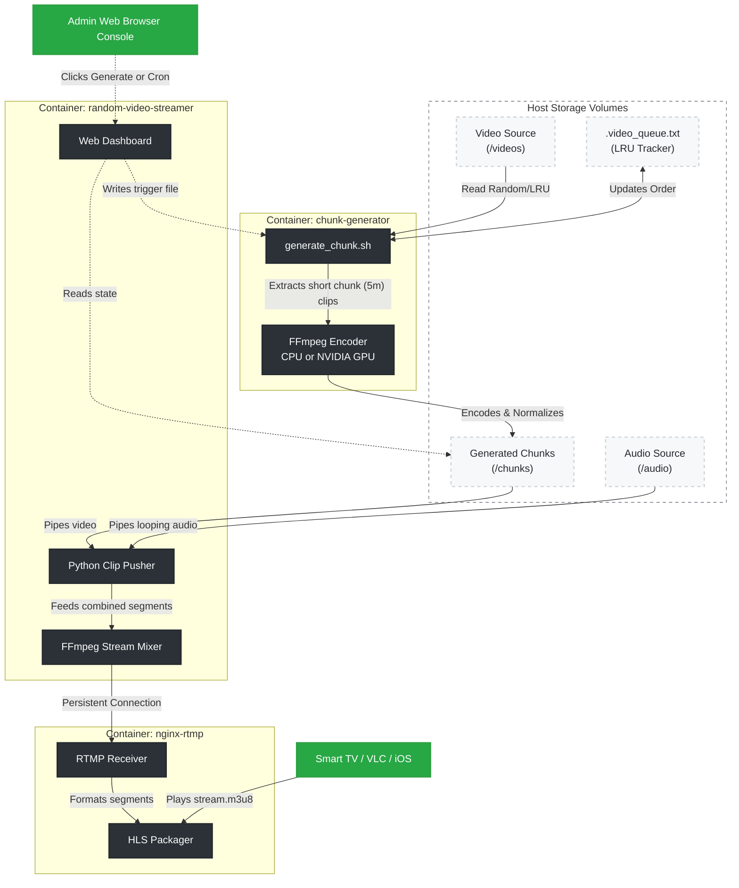

# Random Video Clips Streaming Server

A containerized live streaming server that continuously shuffles and streams random short clips from your video collection and plays them as a never-ending HLS live stream - with optional continuous background audio that plays independently from the video shuffling.

## Features

- **Web Dashboard** — internal UI to monitor chunks, view system status, and manually trigger generation
- **Continuous live stream** — no playback gaps; clips are piped into a single persistent RTMP connection
- **Continuous background audio** — mount an MP3 folder; audio plays uninterrupted while video clips shuffle
- **Strict LRU Smart shuffle** — perfectly cycles through videos using a Least-Recently-Used queue to completely avoid consecutive duplication until all videos are used
- **Normalized output** — all clips transcoded to a consistent resolution/fps so transitions are smooth
- **Compatible** — works with VLC, Safari, Samsung TV IPTV apps, and any HLS player
- **Production-grade** — Dockerized with Gunicorn + gevent, tini init for zombie reaping, healthchecks, and log rotation

## Architecture



The system operates across three decoupled, robust containers:
- **`chunk-generator`** — runs in the background polling for manual UI triggers or automated schedules to crunch video segments down into highly normalized 5-minute `.mp4` chunks. Tracks history to prevent repeats.
- **`random-video-streamer`** — the brain and web interface. Mixes the chunks with continuous looping background audio, preventing gaps in playback and pushing a 24/7 RTMP feed to NGINX.
- **`nginx-rtmp`** — receives the feed, packages it efficiently into HLS segments on a temporary filesystem, and serves it seamlessly to devices over HTTP.

## Quick Start

**1. Configure `.env`:**
```bash
cp .env.example .env
```
Edit `.env`:
```bash
VIDEO_FOLDER=/path/to/your/videos

# Optional: folder of MP3s to play as continuous background audio
# Leave empty for a silent stream
AUDIO_FOLDER=/path/to/your/music

SEGMENT_DURATION=5  # seconds per clip
PORT=8081           # Flask API port
```

**2. Start:**
```bash
docker compose up -d
```

**3. Watch & Manage:**
| URL | Purpose |
|-----|---------|
| `http://server-ip:8081/` | **Web Dashboard** (Monitor chunks, trigger generation) |
| `http://server-ip:8082/hls/stream.m3u8` | **Live HLS stream** (VLC, Safari, TV apps) |
| `http://server-ip:8081/iptv.m3u` | IPTV playlist (points to the HLS stream) |
| `http://server-ip:8081/api/status` | Server status |
| `http://server-ip:8081/api/stream-status` | Clip pusher status |

## Samsung / TV Setup

1. Install an IPTV app (e.g. SS IPTV, TiviMate, Smart IPTV)
2. Add playlist URL: `http://server-ip:8081/iptv.m3u`

The IPTV playlist points to the live HLS stream automatically.

## Configuration

The system is configured via environment variables in the `.env` file and service definitions in `docker-compose.yml`.

### 1. Streamer & API Configuration (`random-video-streamer`)

These variables control the Flask API and the RTMP clip pusher.

| Variable | Default | Description |
|----------|---------|-------------|
| `PORT` | `8081` | Host port for the Flask API and IPTV playlist |
| `VIDEO_FOLDER` | `/videos` | Source video directory (mount in Compose) |
| `AUDIO_FOLDER` | `/audio` | Background MP3 directory. If empty, uses video audio. |
| `CHUNK_FOLDER` | `/chunks` | Directory where `.mp4` chunks are read from |
| `DB_PATH` | `/app/data/segments.db` | SQLite database for tracking played clips |
| `RTMP_URL` | `rtmp://nginx-rtmp:1935/live/stream` | Internal target for the RTMP stream |

### 2. Chunk Generator Configuration (`chunk-generator`)

These variables control how new video chunks are created from your library.

| Variable | Default | Description |
|----------|---------|-------------|
| `CHUNK_DURATION` | `300` | Target length of a single consolidated chunk (seconds) |
| `CLIP_MIN` | `6` | Minimum length of an individual clip within a chunk |
| `CLIP_MAX` | `6` | Maximum length of an individual clip within a chunk |
| `CHUNKS_PER_RUN` | `4` | How many chunks to generate per execution |
| `MAX_CHUNKS` | `56` | Max number of chunks to keep before pruning oldest |
| `VIDEO_DIR` | `/videos` | Where the generator searches for `.mp4`, `.mkv`, `.avi` |
| `OUTPUT_DIR` | `/chunks` | Where the generator writes the final chunks |

## Hardware Requirements

### GPU Acceleration (NVIDIA) vs CPU (Mac / Linux)
The **Chunk Generator** supports both CPU encoding (`libx264`) and NVIDIA hardware acceleration (`h264_nvenc`).

**For CPU Encoding (Default & Mac-compatible):**
- Ensure `.env` has `HW_ACCEL=none`.
- Run completely natively with `docker compose up -d`.

**For NVIDIA GPU Acceleration:**
- **Drivers**: Host must have NVIDIA drivers and `nvidia-container-toolkit` installed.
- **Config**: Set `HW_ACCEL=nvidia` in `.env`.
- **Run**: Use the GPU override file to reserve hardware resources:
  ```bash
  docker compose -f docker-compose.yml -f docker-compose.gpu.yml up -d
  ```

## API Endpoints

| Method | Endpoint | Description |
|--------|----------|-------------|
| GET | `/` | Web Dashboard HTML |
| GET | `/api/status` | Full server status & config overview |
| GET | `/api/stream-status` | RTMP pusher & current audio/chunk info |
| GET | `/iptv.m3u` | IPTV playlist (M3U) for external players |
| POST | `/api/generate_chunk` | Triggers the generator to build new chunks |

## Troubleshooting

**Stream not starting / HLS 404**  
The stream takes ~10 seconds to appear after startup. The app waits for `nginx-rtmp` to be healthy before pushing.

**Check logs:**
```bash
docker compose logs -f random-video-streamer   # Clip pusher & API logs
docker compose logs -f chunk-generator         # Encoding progress logs
docker compose logs -f nginx-rtmp              # HLS server logs
```

## Scripts

- `scripts/setup.sh` — initial setup and environment check
- `scripts/start.sh` — start the streaming server

## License

MIT
