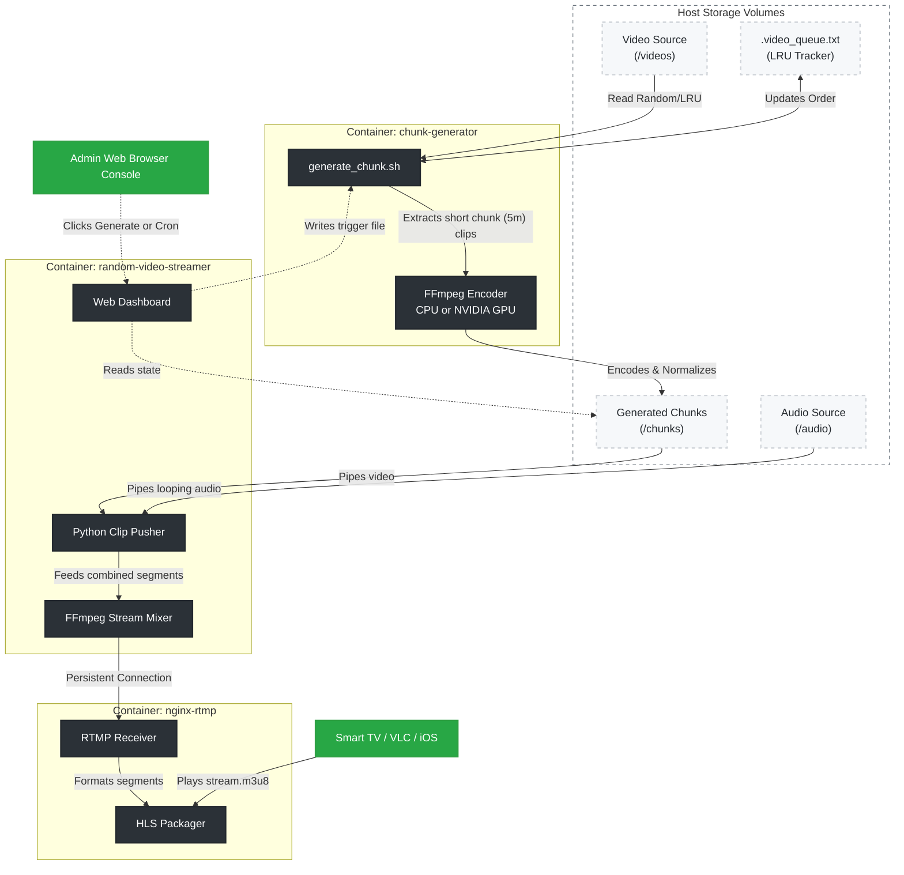

# Random Video Clips Streaming Server

A containerized live streaming server that shuffles and streams short clips from your video collection seamlessly into a never-ending HLS live stream—complete with continuous background audio and a cross-platform Flutter TV/Web UI.

## Key Features
- **Interactive Flutter Client** — A cross-platform web and Android UI providing complete control over chunks, live stream viewing, system metrics, and audio management.
- **Continuous Live Stream** — Zero playback gaps; clips are piped into a single persistent RTMP connection.
- **Continuous Audio Track** — Mount an MP3 folder; the same track plays across video chunk switches.
- **Strict LRU + Segment Tracking** — Clips prefer unused segments, minimizing repetitive content.
- **Normalized Output** — All clips transcoded to a consistent resolution/fps so transitions are butter-smooth.
- **Production-grade** — Dockerized with Gunicorn, healthchecks, GPU-support, and log rotation.

<details>
<summary><strong style="color:#0366d6">🏗️ System Architecture Diagram</strong></summary>


```mermaid
flowchart TD
    %% Define Styles
    classDef container fill:#2b3137,stroke:#24292e,stroke-width:2px,color:#fafbfc
    classDef volume fill:#f6f8fa,stroke:#d1d5da,stroke-width:2px,color:#24292e,stroke-dasharray: 5 5
    classDef output fill:#0366d6,stroke:#0366d6,stroke-width:3px,color:#ffffff,font-weight:bold
    classDef interface fill:#28a745,stroke:#2ea043,stroke-width:2px,color:#ffffff

    %% Subgraphs for Domains
    subgraph Host ["Host Storage Volumes"]
        V["Video Source<br>(/videos)"]:::volume
        A["Audio Source<br>(/audio)"]:::volume
        C["Generated Chunks<br>(/chunks)"]:::volume
        Q[".video_queue.txt<br>(LRU Tracker)"]:::volume
    end

    subgraph Gen ["Container: chunk-generator"]
        bash[generate_chunk.sh]:::container
        ffmpeg1["FFmpeg Encoder<br>CPU or NVIDIA GPU"]:::container
    end

    subgraph Stream ["Container: random-video-streamer"]
        API[Web Dashboard]:::container
        Pusher[Python Clip Pusher]:::container
        ffmpeg2[FFmpeg Stream Mixer]:::container
    end

    subgraph Nginx ["Container: nginx-rtmp"]
        rtmp[RTMP Receiver]:::container
        hls[HLS Packager]:::container
    end

    %% Client Layer
    Dashboard[Admin Web Browser Console]:::interface
    Player[Smart TV / VLC / iOS]:::interface

    %% Generation Flow
    V -->|Read Random/LRU| bash
    Q <-->|Updates Order| bash
    bash -->|"Extracts short chunk (5m) clips"| ffmpeg1
    ffmpeg1 -->|Encodes & Normalizes| C

    %% Streaming Flow
    C -->|Pipes video| Pusher
    A -->|Pipes looping audio| Pusher
    Pusher -->|Feeds combined segments| ffmpeg2
    ffmpeg2 -->|Persistent Connection| rtmp

    %% Final Packaging
    rtmp -->|Formats segments| hls
    
    %% User Interfaces
    API -.->|Writes trigger file| bash
    API -.->|Reads state| C
    Dashboard -.->|Clicks Generate or Cron| API
    Player -->|Plays stream.m3u8| hls

    %% Layout hints
    style Host fill:transparent,stroke:#6a737d,stroke-dasharray: 5 5
    bash ~~~ API
```
</details>

## 🚀 Quick Start

**1. Configure Environment:**
```bash
cp .env.example .env
# Edit .env to set your VIDEO_FOLDER and optionally AUDIO_FOLDER
```

**2. Start the Backend Servers:**
```bash
# Natively starts the API, Chunk Generator, and NGINX HLS packager
docker compose up -d
```

**3. Build & Launch the Client UI:**
```bash
cd scripts/
./build-deploy-flutter.sh
```
_Follow the setup prompt to build your preferred Web or Android APK target. The script will automatically serve the web app locally!_

## 📺 Raw Playback Links
If you just want to consume the stream directly on your Smart TV or Phone (VLC, Safari, Apple TV):
- **Live HLS Stream:** `http://<server-ip>:8082/hls/stream.m3u8`
- **Smart TV IPTV Playlist:** `http://<server-ip>:8081/iptv.m3u`

## ⚙️ Configuration & Hardware
Environment parameters are centrally managed in `.env` and `scripts/flutter_config.env`. 

By default, standard CPU encoding (`libx264`) is enabled. If you have an NVIDIA GPU installed, set `HW_ACCEL=nvidia` in `.env` and run with the GPU architecture override:
```bash
docker compose -f docker-compose.yml -f docker-compose.gpu.yml up -d
```
_For extended metadata extraction features via TubeArchivist, see `TUBEARCHIVIST_URL` inside `.env.example`._

## Core API Endpoints
The Flutter GUI interfaces with the following Flask API (Running on `:8081`):

| Method | Endpoint | Description |
|--------|----------|-------------|
| GET | `/api/status` | Full server status & config overview |
| GET | `/api/stream-status` | RTMP pusher & current chunk/audio progress |
| GET | `/api/system-usage` | Live CPU %, memory %, GPU % |
| POST | `/api/generate_chunk` | Force triggers the generator to build new chunks |
| POST | `/api/skip_to_next` | Skip current chunk and advance to next video smoothly |
| POST | `/api/play_chunk` | Play a specific chunk next in the live stream |

_Refer to `backend/app.py` for all native REST/JSON routes._

## License
MIT
