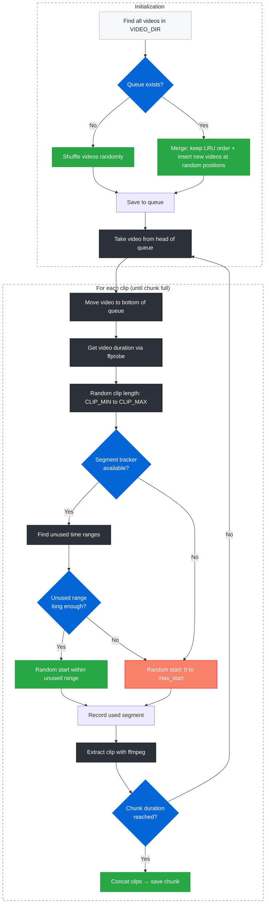

# Chunk Generation Flow

This document describes how the chunk generator builds video chunks from your library: queue management, segment tracking, and clip extraction.

## Flow Diagram

## Behavior Summary

| Aspect | Behavior |
|--------|----------|
| **Which video** | Round-robin over a shuffled queue (LRU: take from head, move to bottom) |
| **New videos** | Inserted at random positions so they get a fair chance to appear soon |
| **Clip length** | Random between `CLIP_MIN` and `CLIP_MAX` |
| **Start time** | Random within unused segments (or fully random if no segment tracker) |
